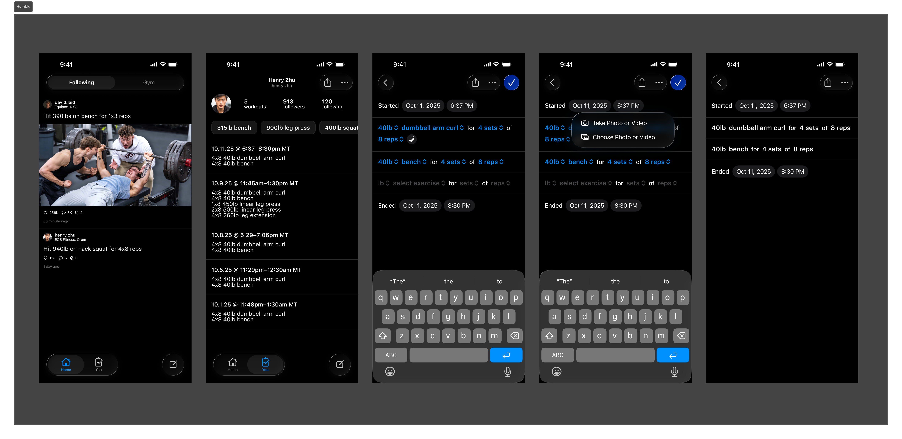

# `humble`

Humble is Strava for weight lifting.

## Design

The Figma designs can be found [here](https://www.figma.com/design/YqdVdRNlAAGyS3iP0LsqBF/Humble?node-id=0-1&t=P3dm0Gs9otOFzNGC-1).
Included below is a screenshot for convenience.



Individual screenshots can be found in the `/designs` directory.

## Pitch
Share your workout journey with friends and celebrate the highs! This semester I propose we make the Strava equivalent for weightlifting. A lightweight and direct method to track and save your gym workouts and share them with friends who are also on their own workout journeys!

### Possible Features
- Easy Method for tracking workouts in charts
- Photo and Short Video storage for PR lifts or updates
- Simple feed of 'posts' for friends you follow to see their progress
- 'Live' Button where you can display that you are currently working out.
- Profile Page that displays your PR's and recent workouts
- Gym leadership board, perhaps based on location

### Possible Architecture
I envision this being most achievable as a ReactNative App that uses SQL storage for users and data and Object storage for photo and videos

### Team Members

1. **Cole Strong** (Project Manager)
2. **Matthew Lund** (Software Architect)
3. **Peter Sloan** (Front-End)
4. **Nicholas Chiang** (Quality Assurance / Gatekeeper)
5. **Samuel Galbraith** (Back-End)

### Potential Implementation
We are planning to start with a ReactNative app using Expo, initially targeting Apple users for simplicity and wider audience range. We are discussing multiple possible databases to use that will provide us with sufficient storage and possibly provide the authentication architecture for us as well.

## Welcome to your Expo app 👋

This is an [Expo](https://expo.dev) project created with [`create-expo-app`](https://www.npmjs.com/package/create-expo-app).

## Get started

1. Install [`node`](https://nodejs.org/en). We recommend using [`mise`](https://mise.jdx.dev/getting-started.html) to do this.

   ```bash
   mise use
   ```

2. Install [`just`](https://github.com/casey/just?tab=readme-ov-file#installation).

   ```bash
   cargo install just
   ```

3. Install dependencies.

   ```bash
   corepack enable
   just install
   ```

4. Configure environment.

   ```bash
   cp .env.example .env.local
   vim .env.local 
   ```

5. Start the app.

   ```bash
   just start
   ```

In the output, you'll find options to open the app in a

- [development build](https://docs.expo.dev/develop/development-builds/introduction/)
- [Android emulator](https://docs.expo.dev/workflow/android-studio-emulator/)
- [iOS simulator](https://docs.expo.dev/workflow/ios-simulator/)
- [Expo Go](https://expo.dev/go), a limited sandbox for trying out app development with Expo

You can start developing by editing the files inside the **app** directory. This project uses [file-based routing](https://docs.expo.dev/router/introduction).

## Learn more

To learn more about developing your project with Expo, look at the following resources:

- [Expo documentation](https://docs.expo.dev/): Learn fundamentals, or go into advanced topics with our [guides](https://docs.expo.dev/guides).
- [Learn Expo tutorial](https://docs.expo.dev/tutorial/introduction/): Follow a step-by-step tutorial where you'll create a project that runs on Android, iOS, and the web.

## Join the community

Join our community of developers creating universal apps.

- [Expo on GitHub](https://github.com/expo/expo): View our open source platform and contribute.
- [Discord community](https://chat.expo.dev): Chat with Expo users and ask questions.
